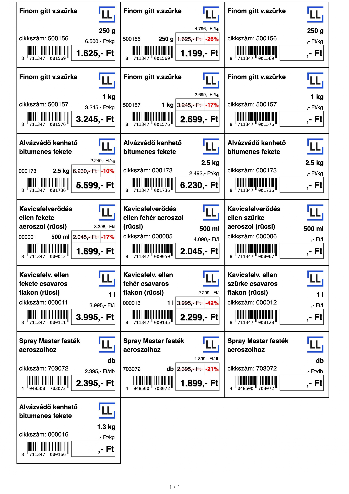

# Label Labor

A web application for small and medium-sized businesses that turns an Excel price list into print-ready shelf labels (PDF) — with EAN-13 barcodes, unit price calculations, and an AI-assisted data validation step.

Built as a real product with paying customers: each client gets a branded sub-page tailored to their label layout and Excel format.

> A portfolio project based on a real, live product. The code is public for review, but it is **not** open-source — see [License](#license).

## Screenshots

<p align="center">
  
</p>
<p align="center">
  
  
</p>

Generated, print-ready labels:



## How it works

1. The store owner logs in and lands on their company-specific generator page.
2. They upload their `.xlsx` price list (drag & drop supported).
3. A validation agent checks every row — unit formats, price consistency, EAN-13 checksums, text overflow — and proposes fixes the user can accept, edit, or skip.
4. Labels are rendered in the browser (live preview) and exported as a print-ready A4 PDF.

## Features

- **Excel → PDF pipeline** entirely client-side rendering: SheetJS parsing, JsBarcode for EAN-13, html2pdf for export
- **AI validation agent** (Anthropic Claude): detects and auto-fixes data issues, with batch deduplication for repeated error patterns and AI-generated fix suggestions for ambiguous cases
- **Per-client configuration**: each customer has its own label layout, unit logic, and Excel schema defined in `agent/subpage_configs.py`
- **Bilingual landing page** (HU/EN) with live label counter animation
- **Price change detector** (`arvaltozas.py`): CLI tool that diffs two price list versions

## Security

- JWT-based auth (12h expiry) with bcrypt password hashing
- Rate limiting on all endpoints (slowapi), with real client IP extraction behind the Railway proxy
- CORS allowlist, API docs disabled in production
- All secrets via environment variables

## Tech stack

| Layer | Technologies |
|---|---|
| Backend | Python, FastAPI, Supabase (PostgreSQL), PyJWT, bcrypt, slowapi, Resend |
| AI agent | Anthropic API (Claude), openpyxl |
| Frontend | Vanilla HTML/CSS/JS — no framework, no build dependency at runtime |
| Frontend libs | JsBarcode, html2pdf, Lucide icons (vendored) |
| Tooling | Terser + csso for minification, Playwright for testing |
| Hosting | Railway (API), static frontend |

## Project structure

```
├── main.py              # FastAPI app: auth, label endpoints, rate limiting
├── agent/               # Validation + AI pipeline
│   ├── validator_agent.py   # Row validation, batch auto-fix logic
│   ├── ai_suggestions.py    # Claude-generated fix suggestions
│   ├── tools.py             # Row processing, unit/price parsing
│   └── subpage_configs.py   # Per-client configuration
├── index.html           # Landing page (HU/EN)
├── main.js / style.css / language.js
├── Ditall/ EA/ Hudak/ LL/ Ritzer/   # Client-specific generator pages
│   └── <client>.html / .css / script.js / Excel template
├── arvaltozas.py        # Price list diff CLI tool
└── vendor/              # Vendored frontend libraries
```

## Configuration & deployment

The API (FastAPI) is deployed on Railway; the frontend is static — vanilla HTML/CSS/JS with no runtime build step. Everything is configured through environment variables, so no secrets ever live in the code:

| Variable | Purpose |
|---|---|
| `SUPABASE_URL`, `SUPABASE_SERVICE_ROLE_KEY` | PostgreSQL access (users, label data) |
| `SECRET_KEY` | JWT signing |
| `ANTHROPIC_API_KEY` | the Claude validation agent |
| `RESEND_API_KEY` | transactional email (optional) |
| `FRONTEND_URL` | CORS origin |

Backend dependencies are split between the API (`requirements.txt`) and the AI agent (`agent/requirements.txt`); frontend assets are minified with Terser + csso.

## License

© 2026 Zsombor Galgóczi. **All rights reserved.**

This repository is **source-available for portfolio and evaluation purposes only**. You are welcome to read the code, but copying, modifying, redistributing, or reusing it — in whole or in part — requires prior written permission. See [LICENSE](LICENSE) for the full terms.

---

*Author: Zsombor Galgóczi — [zsombor.galgoczi@gmail.com](mailto:zsombor.galgoczi@gmail.com)*
