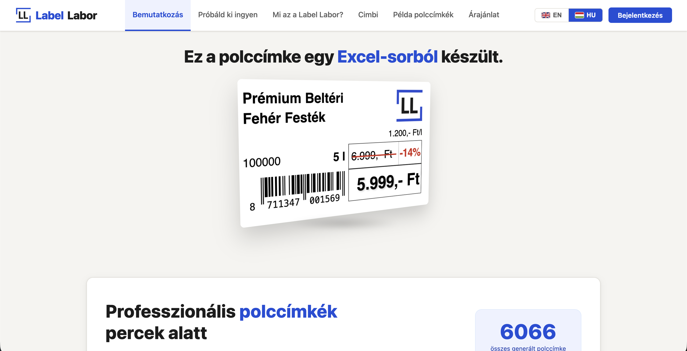
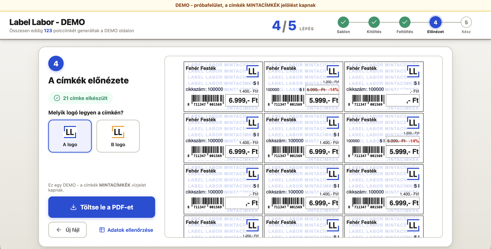
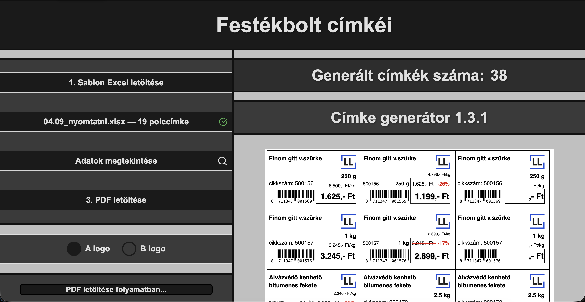
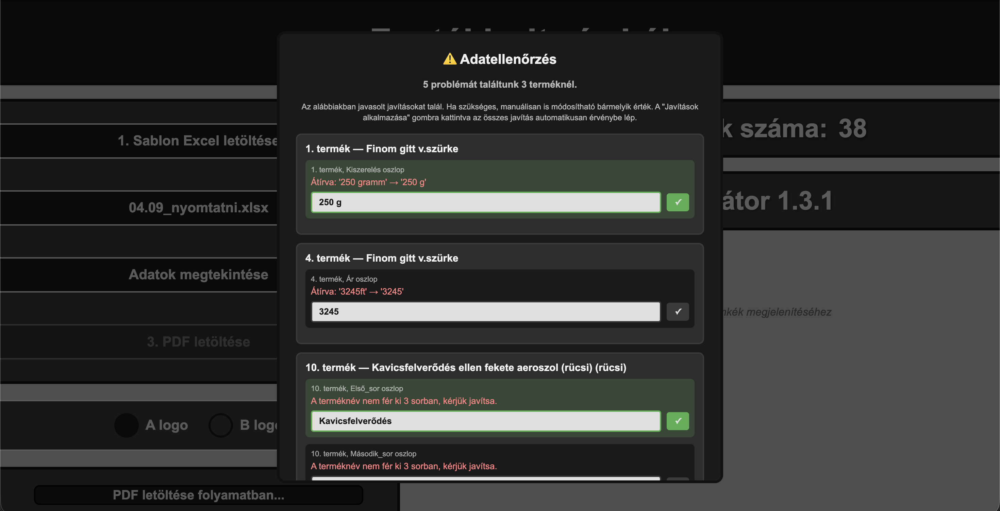

# Label Labor

A web application for small and medium-sized businesses that turns an Excel price list into print-ready shelf labels (PDF) — with EAN-13 barcodes, unit price calculations, and an AI-assisted data validation step.

Built as a real product with paying customers: each client gets a branded sub-page tailored to their label layout and Excel format.

> A portfolio project based on a real, live product. The code is public for review, but it is **not** open-source — see [License](#license).

## Screenshots

<!--
  Save screenshots as PNG under docs/screenshots/ with the exact filenames below.
  Suggested capture (desktop, ~1440px wide window, Hungarian UI):
  - landing.png    : the landing page hero (title + 3D label + "try the demo" CTA)
  - demo.png       : the demo wizard on step 4 (label preview + "download PDF" + MINTACÍMKÉK watermark visible)
  - generator.png  : a customer generator page with an Excel uploaded and the live label grid on the right
  - validation.png : the AI validation modal listing detected issues with suggested fixes
-->

<p align="center">
  
</p>
<p align="center">
  
  
</p>
<p align="center">
  
</p>

Generated, print-ready labels:


## How it works

1. The store owner logs in and lands on their company-specific generator page (or anyone can try the public, guided **demo**).
2. They upload their `.xlsx` price list (drag & drop supported).
3. A validation agent checks every row — unit formats, price consistency, EAN-13 checksums, text overflow — and proposes fixes the user can accept, edit, or skip.
4. Labels are rendered in the browser (live preview, with double-click inline editing) and exported as a print-ready A4 PDF.

## Features

- **Excel → PDF pipeline**, client-side rendering: SheetJS parsing, JsBarcode for EAN-13, html2pdf for export — the print-ready PDF is generated straight from the rendered DOM
- **AI validation agent** (Anthropic Claude): detects and auto-fixes data issues, with batch deduplication for repeated error patterns and AI-generated suggestions for ambiguous cases
- **Config-driven per-client pages**: each customer's label layout, unit logic, and Excel schema live in one config (`agent/subpage_configs.py` + `frontend/src/config/subpages.ts`) — a new client is a new config entry
- **Guided public demo**: a 5-step wizard that walks a first-time user to a downloaded PDF, with a baked-in "MINTACÍMKÉK" watermark and server-side rate/volume caps
- **Natural-language label assistant** ("Cimbi"): edit labels via chat commands, parsed by an AI intent parser
- **Inline label editing** and a tabular data view for quick corrections
- **Bilingual landing page** (HU/EN) with a live label-counter animation and an interactive quote configurator
- **Price change detector** (`arvaltozas.py`): diffs two price-list versions

## Security

- JWT-based auth (12h expiry, 1h for demo) with bcrypt password hashing
- Rate limiting on all endpoints (slowapi), with real client IP extraction behind the Railway proxy
- Cloudflare Turnstile CAPTCHA for demo access; server-enforced demo caps
- Client- **and** server-side input length/size limits; AI prompt-injection hardening (cell text treated as data, strict tool schema)
- CORS allowlist, API docs disabled in production, 2 MB request body limit
- All secrets via environment variables — nothing hardcoded

## Tech stack

| Layer | Technologies |
|---|---|
| Backend | Python, FastAPI, Supabase (PostgreSQL), PyJWT, bcrypt, slowapi, Resend |
| AI agent | Anthropic API (Claude), openpyxl |
| Frontend | React 19, TypeScript, Vite, React Router |
| Frontend libs | SheetJS (xlsx), JsBarcode, html2pdf.js, lucide-react |
| Tooling | Vitest (unit), Playwright (e2e), oxlint, `tsc` type-checking |
| Hosting | Railway (API), Netlify (frontend) |

## Project structure

```
├── main.py                  # FastAPI app: auth, label endpoints, rate limiting, demo caps
├── arvaltozas.py            # Price-list diff tool
├── agent/                   # Validation + AI pipeline
│   ├── validator_agent.py       # Row validation, batch auto-fix logic
│   ├── ai_suggestions.py        # Claude-generated fix suggestions
│   ├── command_parser.py        # Natural-language label commands (AI chat)
│   ├── tools.py                 # Row processing, unit/price parsing
│   └── subpage_configs.py       # Per-client backend configuration
├── requirements.txt
└── frontend/                # React + TypeScript + Vite single-page app
    ├── src/
    │   ├── pages/Landing.tsx        # Landing page (HU/EN)
    │   ├── components/              # GeneratorPage, DemoWizard, LabelCard, ValidationModal, CimbiChat, …
    │   ├── config/subpages.ts       # Per-client frontend configuration
    │   ├── i18n/                    # HU/EN translations
    │   ├── hooks/  auth/  api/  lib/  styles/  types/
    │   └── App.tsx
    └── public/                  # Static assets, legal pages
```

## Configuration & deployment

The API (FastAPI) is deployed on Railway; the frontend (Vite build) is deployed on Netlify. Everything is configured through environment variables, so no secrets ever live in the code:

| Variable | Purpose |
|---|---|
| `SUPABASE_URL`, `SUPABASE_SERVICE_ROLE_KEY` | PostgreSQL access (users, label data) |
| `SECRET_KEY` | JWT signing |
| `ANTHROPIC_API_KEY` | the Claude validation agent |
| `RESEND_API_KEY` | transactional email |
| `NOTIFY_EMAIL` | recipient for label-generation notifications |
| `TURNSTILE_SECRET_KEY` | Cloudflare Turnstile (demo CAPTCHA) |
| `FRONTEND_URL` | CORS origin |

The frontend reads `VITE_API_URL` and `VITE_TURNSTILE_SITE_KEY` at build time. Backend dependencies are split between the API (`requirements.txt`) and the AI agent (`agent/requirements.txt`).

## License

© 2026 Zsombor Galgóczi. **All rights reserved.**

This repository is **source-available for portfolio and evaluation purposes only**. You are welcome to read the code, but copying, modifying, redistributing, or reusing it — in whole or in part — requires prior written permission. See [LICENSE](LICENSE) for the full terms.

---

*Author: Zsombor Galgóczi — [zsombor.galgoczi@gmail.com](mailto:zsombor.galgoczi@gmail.com)*
